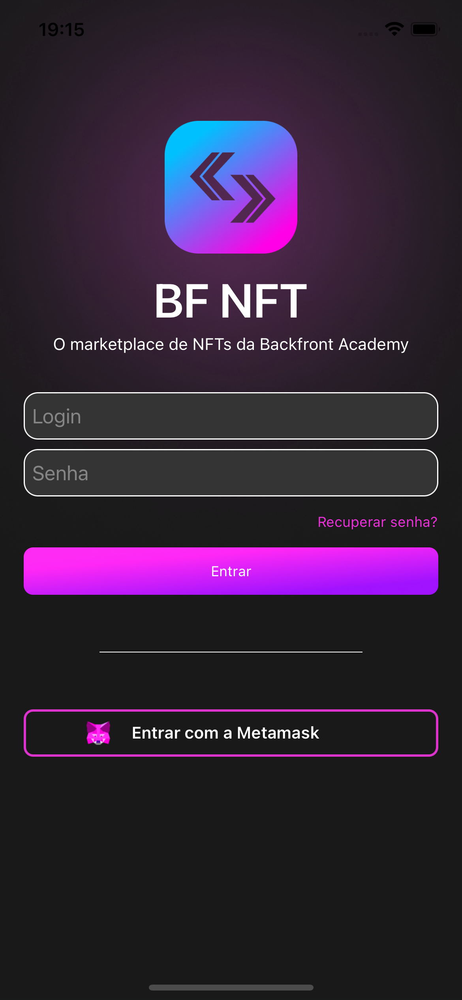

## Como fazer uma tela de login com viewcode

 
<a href="https://www.youtube.com/watch?v=UuF3REL2iqI">Link do tutorial</a>

### O que aprendi com esse projeto

- Constraints
- Fazer um botão com uma imagem de fundo
- Fazer um botão com uma imagem ao lado da label